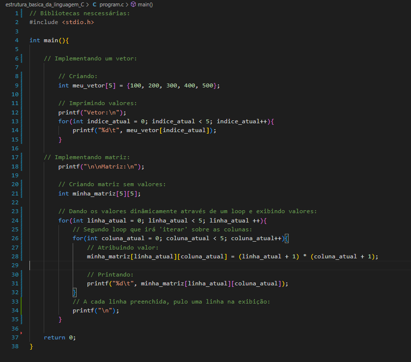

# Características básicas da linguagem de programação C

## Introdução:
    
Este artigo foi criado para expor as principais carcterísticas mais básicas da linguagem C. Explorando conceitos que irão dar ao leitor uma idéia básica de como funciona a sintaxe e a semântica da linguagem. 

## História da linguagem:

#### A pessoa da foto é [Dennis Ritchie](https://pt.wikipedia.org/wiki/Dennis_Ritchie), ele foi um dos criadores da linguagem.

A primeira versão da linguagem C foi introduzida em 1972 nos laboratórios Bell, onde esta versão seria incluida como um dos softwares que seriam apresentados no sistema operacional UNIX do computador PDP-11. A equipe encarregada deste trabalho era certificada por  [Ken Thompson](https://pt.wikipedia.org/wiki/Ken_Thompson). 

O surgimento da linguagem é oriúndo de uma linguagem de programação chamada [ALGOL](https://pt.wikipedia.org/wiki/ALGOL), que na época era considerada uma linguagem de alto nível, ou seja, permitia que o programador desenvolvesse sem se precupar muito com os aspéctos da máquina. O ALGOL não obteve muito suscesso, então depois de algum tempo, surgiu a [CPL](https://en.wikipedia.org/wiki/CPL_(programming_language)#:~:text=CPL%20(Combined%20Programming%20Language)%20is,the%20BCPL%20and%20B%20languages.), vindo das universidades de Londres e Cambridge. A CPL também não foi muito aceita na época, principalmente por projetistas de sistemas operacionais, que a consideravam difícil.

Após isso, foi criada a linguagem [BCPL](https://pt.wikipedia.org/wiki/BCPL) por Martin Richards, em Cambridge. Sua proposta era "manter apenas as coisas boas da CPL". Então, Ken Thompson criou um compilador para uma versão mais reduzida do CPL, e chamou esta criação de [linguagem B](https://pt.wikipedia.org/wiki/B_(linguagem_de_programa%C3%A7%C3%A3o)), sendo que a mesma era caracterizada por ser uma linguagem "lenta". Por esse e outros motivos, Dennis Ritchie foi encarregado de projetar uma nova linguagem, que seria suscessora da linguagem B. Foi ai que surgiu o que conhecemos hoje como linguagem C.

No início, o C tinha como propósito manter o contato de interação com o hardware, mas também conseguir proporcionar ao programador criar softwares diversos, tanto para a área cintífica, de engenharia e etc. O padrão de sintaxe desta versão criada, está presente principalmente no livro ["The C programming language"](https://en.wikipedia.org/wiki/The_C_Programming_Language), que é considerado a "bíblia" da linguagem. Uma das características principais que esta versão herdou, era a de que os programas criados podiam ser facilmente compilados e executados em outros computadores, dando a linguagem o rótulo de ser "Portável".

Em 1985, foi estabelecido um padrão para a linguagem, que foi denominado [C ANSI](https://en.wikipedia.org/wiki/ANSI_C). ANSI são as siglas da "American National Standards Institute" que foi a instituição que implementou este padrão. Há outra versão evoluida do C, conhecida como C++.

## Características gerais:

C é considerada uma linguagem de médio nível, ou seja, está entre os conceitos de linguagens de [alto e baixo nível](https://www.dio.me/articles/linguagens-de-programacao-de-alto-e-baixo-nivel). C  permite a manipulação de bytes e endereços de memória,  é uma linguagem que segue o paradígma de programação "estruturada", e tem suas implementações baseadas principalmente em [funções](https://www.ime.usp.br/~leo/mac2166/2017-1/introducao_funcoes.html). Com isso, é possível determinar que o principal componente estrutural do C são as funções, sendo que a principal função do programa é a denominada função "main()".

## Tipos primitivos:

As variáveis em C podem possuir os seguintes tipos básicos:
- char 
- int
- double 
- float

**Char**: Armazena um caractere ou uma cadeia de caracteres. Em C, não temos o tipo "String" definido, então, para armazenar um valor com mais de um caractere, é preciso criar um [vetor](https://linguagemc.com.br/vetores-ou-arrays-em-linguagem-c/) de caraceteres, onde cada índice do vetor corresponde a um valor da String. 

**Int**: É usado para armazenar valores numéricos inteiros, sendo que há um limite para o tamanho desses valores, que é de 4 bytes(32 bits). 

**Float**: Basicamente, é usado para armazenar valores de ponto flutuante, ou seja, valores com casas decimais estabelecidas. Este tipo também consegue armazenar valores de até 4 bytes.

**Double**: Segue as mesmas implementações do tipo float, a diferença como o própio nome ja diz, é que neste tipo é possível armazenar o dobro do que se pode armazenar em float, ou seja, 8 bytes(64 bits).

#### Exemplo de implementação dos tipos citados:

## Palavras reservadas:

Outro aspécto muito importante no conhecimento de uma linguagem, são as palavras reservadas, abaixo é mostrada uma lista com as palavras reservadas da linguagem C:

## Entrada e saida de dados:

A entrada e saida de dados em linguagem C pode ser implementada de várias formas, como em programas básicos usando as funções ``printf()`` para imprimir valores via console e ``scanf()`` para receber dados do usuário via teclado, ambas pertencentes a biblioteca padrão "stdio". Outra forma é quando se está trabalhando com leitura e escrita em arquivos, tanto de forma binária quanto da forma usual. Neste caso, são usadas as funções abaixo:

- ``putc()`` : Para inserir um caractere qualquer no arquivo.
- ``getc()``: Para ler um caractere qualquer.
- ``putsc() e getsc()``: Para escrever e ler múltiplos caracteres em um arquivo, respectivamente.
- ``fprintf() e fscanf()``: São equivalentes as funções padrão que foram citadas acima, só que estão relacionadas com manipulação de arquivos. Neste caso, ``fprintf()`` escreve no arquivo e ``fscanf()`` ler algum valor do arquivo.

Para terem uma idéia mais fundamentada de como trabalhar com essas funções, aconselho que visitem [este link](https://www.freecodecamp.org/portuguese/news/manipulacao-de-arquivos-em-c-como-abrir-e-fechar-arquivos-e-escrever-algo-neles/).

Um dos aspéctos mais importantes deste assunto de entrada e saida de dados, é a formatação a partir do tipo correspondente. Sem a formatação, não é possível realizar as operações corretamente. Abaixo estão as formatações correspondentes aos tipos primitivos:

- ``%c``: Caracteres únicos;
- ``%s``: Cadeia de caracteres;
- ``%d``: Número inteiro(int);
- ``%f``: Valores do tipo float;
- ``%lf``: Valores double;

Certo, agora que você já viu a teoria básica, implementei alguns exemplos abaixo, dê uma olhada:

Exemplo de entrada e saida normal:

Entrada e saida com arquivos:

## Definindo constantes:

Constantes como o própio nome já expõe, são valores que não alteram com tanta frequência ou quase nunca, ou seja, quando você estiver trabalhando com valores que dificilmente ou nunca irão mudar no seu código, as constantes são usadas, para armazenar esses valores. Há muitas maneiras de definir constantes em C, mas vamos focar em duas maneiras principais de definir. A primeira diz respeito a definir o valor a partir da sintaxe ``#define``, essa maneira está relacionada a fase de pré-processamento do programa, onde o compilador reconhece o valor definido e o chama de acordo com a implementação do código. Já a segunda é um caso mais comúm, que é quando usamos a palavra reservada ``const`` para definir as constantes. Abaixo há uma ilustração de como fazer a definição nos dois casos:

## Comando condicionais:

É impresindível conhecer de comandos condicionais para ter um código bem implementado, independente do contexto da aplicação com que se está trabalhando. Em C, a sintaxe dos comandos condicionais não foge tanto do padrão que é visto em outras linguagens, basicamente esse padrão raramente muda nas linguagens mais usadas no mercado. Na minha opinião, o que é mais preciso se atentar nesses casos, é o aspécto de semântica, ou seja, qual o resultado que você quer ao usar estes comandos de condição, pois basicamente é para isso que eles são usados. Em C, a sintaxe dos comandos de repetição são representadas principalmente com as palavras: ``if``, ``else`` e ``swicth``. Veja implementações de comandos condicionais em C abaixo:

## Comandos de repetição:

Tão importante quanto os comandos de condição, são os comandos de repetição. Com eles é mais fácil obter ou inserir valores em listas, por exemplo. O seu uso é muito corriqueiro em qualquer contexto de sistema ou implementação de um programa. As sintaxes básicas para utilizar comandos de repetição em C, são as seguintes: ``for``, ``while`` e ``do while``, onde cada uma tem seus casos onde é nescessário utilizá-las. Dê uma olhada nas implementaçoes abaixo:

## Vetores e Matrizes:

O uso de vetores e matrizes está fortemente associado a quando você quer armazenar múltiplos valores de um mesmo tipo, ou seja, vetores e matrizes facilitam o armazenamento de várias variáveis de um mesmo tipo em um mesmo local. O acesso a essas variáveis é feito por meio dos índices. A maioria das linguagens tem a característica de começar a contar os valores dos índices pelo 0, sendo assim, a variável de número 1 de um determinado vetor, está armazenada no índice 0 do mesmo. É possível criar vetores e matrizes de todos os tipos primitivos citados, desde que os valores das variáveis sejam do mesmo tipo. 

Qual a diferença entre vetor e matriz? É bem simples, vetores são estruturas unilineares, ou seja, seus valores são armazenados em uma única linha, diferente da matriz que tem por característica o armazenamento de valores em múltiplas linhas. Oberve o exemplo de implementação abaixo:

Implementando vetor e matriz:

Saida no terminal:

## Strings:

Como já falado anteriormente, a linguagem C é diferente das outras outras linguagens quando o assunto é criação de strings, pois em C não há o tipo primitivo ``String``. Para criar uma string, é preciso usar os conhecimentos do tópico anterior(vetor e matriz). Pois, neste linguagem, strings são ``vetores de caracteres``, já que o único tipo primitivo existente é o de caracteres únicos, que é o tipo ``char``. Há uma biblioteca bastante útil relacionada a strings em C, que possúi funções muito úteis quando está se trabalhando com este tipo de dado, que é a biblioteca ["string.h"](https://linguagemc.com.br/a-biblioteca-string-h/).

Dê uma olhada em como implementar uma string em C :

## Estruturas(Registros):

Este é um "tipo" de dado especial, pois ele permite armazenar em um único local valores de diferentes tipos, ou seja, é possível armazenar inteiros, strings, caracteres, numeros de ponto flutuante, vetores e entre outros tipos em um mesmo local. O seu uso vem da palavra reservada ``struct``, onde é nescessário passar um nome para a estrutura, e abaixo, criar variáveis que irão armazenar os campos que foram implementados dentro da estrutura, sendo parecido com o processo de criar objetos em linguagens que são orientadas a objeto. Enfim, irei dar uma idéia geral apenas. Se quer aprender mais sobre este tema tão poderoso, [clique aqui](https://linguagemc.com.br/struct-em-c/) 

Esta é uma implementação básica:

## Funções:

O uso de funções está fortemente relacionado a quando você está repetindo um bloco de código muitas vezes no seu programa ou quando você decide por organizar o seu programa em subrotinas, que nada mais é do que implementar o programa em blocos organizados, onde cada bloco é responsável por executar algo para o sistema. Em c, temos a função ``main()``, que é a função que o compilador verifica no momento da execução. É uma boa prática ao programar em C, fazer com que a função main funcione como um "esboço" do que o programa faz, ou seja, que a função main apenas chame as outras funções correspondentes do programa. Sendo assim, o uso de funções é impressindível para ter um código organizado e mais fácil de manter.

Veja este exemplo de um programa que está organizado em funções:

## Arquivos:

Este tema está relacionado basicamente a execução de escrita e leitura de dados em um arquivo qualquer, seja escrita de caracetere normais ou de valores binários. Estas implementações, são feitas a partir de funções correspondentes, vou listar algumas abaixo:

- ``fopen()``: Para realizar a abertura de um arquivo.
- ``fclose()``: Fazer o fechamento do arquivo.
- ``rewind()``: Posicionar o arquivo em seu início.
- ``feof()``: Para verificar se o arquivo já está no fim.

Existem muitas outras, se quiser se aprofundar mais neste assunto, disponibilizei [este link](https://linguagemc.com.br/arquivos-em-c-categoria-usando-arquivos/) .

Há um exemplo de entrada e saida de dados com arquivos [neste tópico](./README.md#entrada-e-saida-de-dados) do artigo, onde é possível analisar como é feito estas implementações.

## Considerações:

Se você leu até aqui, espero que tenha gostado do que aprendeu. Minha intenção era somente passar o mínimo do básico desta linguagem de programação tão poderosa. Para se aprofundar mais, clique nos links que disponibilizei, ou acesse [este site](https://linguagemc.com.br/), ele dispõe de vários artigos que com certeza irá te ajudar.

